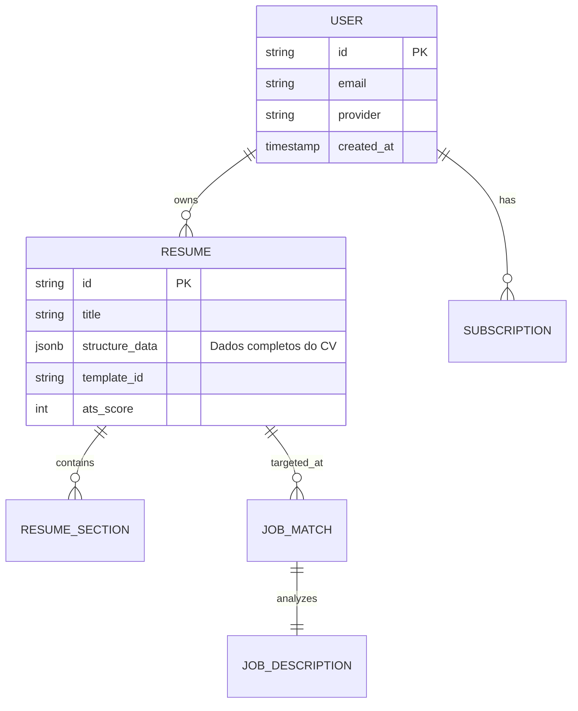

# CV.AI - Architectural Blueprint & Product Specification

## 1. Visão do Produto

**Nome:** CV.AI  
**Slogan:** Seu currículo. Potencializado por IA.  
**Missão:** Democratizar oportunidades de emprego utilizando Inteligência Artificial para transformar histórias de vida em currículos de alto impacto, removendo barreiras de comunicação e design.

### Objetivos Estratégicos (90 dias)
- **MVP Funcional:** Editor completo, Geração via IA, Exportação PDF.
- **User Base:** 10.000 usuários cadastrados.
- **Receita:** Conversão de 5% para planos pagos.
- **Performance:** Score ATS médio > 85% nos currículos gerados.

---

## 2. Funcionalidades Principais

### 👤 Módulo Usuário
- **Auth:** Login Social (Google/GitHub) e Email/Senha via **Firebase Auth**.
- **Onboarding:** Coleta guiada de dados (Wizard).
- **Importação:**
  - Parse de PDF existente (OCR/NLP).
  - Integração LinkedIn (Export Data).
- **Dashboard:** Visão geral de candidaturas, currículos criados e métricas de perfil.

### 📄 Módulo Gerador (Core)
- **Editor Visual:** Interface "Drag & Drop" (inspirado em Enhancv/Canva) com preview em tempo real.
- **Templates:** Layouts testados e aprovados por sistemas ATS (Applicant Tracking Systems).
- **IA Copilot:**
  - *Magic Rewrite:* Reescreve descrições de cargo para serem orientadas a resultados (Ex: "Fiz vendas" -> "Aumentei o faturamento em 20%...").
  - *Keyword Optimizer:* Sugere palavras-chave baseadas na área de atuação.
  - *Grammar Check:* Correção ortográfica e de tom.

### 🎯 Módulo Matching (Vagas)
- **Input:** URL da vaga ou Texto da descrição.
- **Análise:** Comparação semântica (Embedding) entre Currículo x Vaga.
- **Gap Analysis:** "Você tem 70% de aderência. Falta experiência em 'Kubernetes'. Adicione isso se for verdadeiro."

---

## 3. Arquitetura Técnica (Google Cloud Platform)

A arquitetura segue o padrão **Microservices-ready** mas inicia como um **Monolito Modular** para agilidade do MVP, preparado para escala.

### Tech Stack
- **Frontend:** Next.js (App Router), Tailwind CSS, Shadcn/UI, React-PDF.
- **Backend API:** Fastify (Node.js) rodando em Cloud Run.
- **Database:** PostgreSQL (Cloud SQL) para dados relacionais (Users, Subs) + Firestore para dados não estruturados (Resume Drafts, JSON Blobs).
- **IA/ML:** Google Vertex AI (Gemini Pro) para geração e embeddings.
- **Storage:** Google Cloud Storage (PDFs, Avatars).
- **Queue/Async:** Google Pub/Sub (para geração de PDF pesada ou jobs de análise).

### Diagrama de Dados (Conceitual)

### Fluxo de IA (Pipeline RAG + Generation)
1. **User Input:** Usuário insere "Fui gerente na loja X".
2. **Enrichment:** Backend envia para Vertex AI com prompt: *"Atue como recrutador sênior. Reescreva a experiência focando em liderança e métricas de varejo."*
3. **Refinement:** Usuário aprova/edita.
4. **Finalization:** O dado estruturado é renderizado no PDF.

---

## 4. UX & Design System

**Referência Visual:** Minimalista, Fundo claro, Acentos em cores confiáveis (Azul Navy, Verde Esmeralda). "Glassmorphism" sutil em modais.

### Jornada do Usuário (Happy Path)
1. **Landing:** Promessa clara -> "Melhore seu CV em segundos".
2. **Sign-up:** One-click Google.
3. **Import/Create:** "Carregar LinkedIn" ou "Começar do Zero".
4. **Editor:** Tela dividida. Esquerda: Formulários/IA. Direita: Preview do documento A4 (Live).
5. **Otimização:** Botão "Analisar com IA" mostra score e sugestões.
6. **Export:** Pagamento (se Pro) -> Download PDF.

### Microcopy
- Evitar: "Insira dados".
- Usar: "Conte-nos sobre suas vitórias profissionais".
- Feedback de Sucesso: "Ótimo! Sua experiência soou 3x mais impactante agora."

---

## 5. Modelo de Negócio

### Tiers
1. **Free:** 1 Currículo, Template Básico, IA limitada (3 usos/dia), Com marca d'água discreta.
2. **Pro (R$ 29,90/mês):** Currículos ilimitados, IA ilimitada, Todos templates, Matching de Vagas, Sem marca d'água.
3. **Lifetime/One-off (R$ 59,90):** Download único do currículo perfeito (Upsell transacional).

### Estratégia de Aquisição (PLG - Product Led Growth)
- Ferramentas gratuitas de isca (ex: "Calculadora de Score de Currículo").
- Watermark no plano free "Gerado por CV.AI" (Viral loop).

---

## 6. Prompt Engineering Strategy

### Estrutura Base do Prompt (System Instruction)
> "Você é um especialista em carreira e recrutamento tech com 20 anos de experiência. Seu objetivo é tornar currículos irresistíveis para recrutadores e legíveis para robôs (ATS). Use verbos de ação. Priorize resultados numéricos. Evite clichês como 'proativo' ou 'vestir a camisa'."

### Módulos
- **Rewriter:** Input cru -> Output polido (STAR Method).
- **Matcher:** CV Text + Job Description -> % Match + Missing Keywords.
- **Translator:** Tradução contextual (PT-BR <-> EN-US).

---

## 7. Roadmap de Desenvolvimento (MVP)

### Fase 1: Fundação (Semanas 1-2)
- Setup Repo (Monorepo ou Front/Back separados).
- Configuração Firebase Auth + PostgreSQL.
- Setup Google Cloud (Vertex AI access).
- Design System (Shadcn + Tailwind).

### Fase 2: Core Editor (Semanas 3-6)
- CRUD de Currículos.
- Editor Visual (Forms à esq, Preview à dir).
- Geração de PDF (server-side ou client-side robusto).

### Fase 3: Camada de IA (Semanas 7-9)
- Integração Gemini API.
- Funcionalidade "Reescrever com IA".
- Otimizador de palavras-chave.

### Fase 4: Lançamento (Semanas 10-12)
- Integração Stripe.
- Landing Page de alta conversão.
- Testes de Carga e Segurança.
- Go Live!
